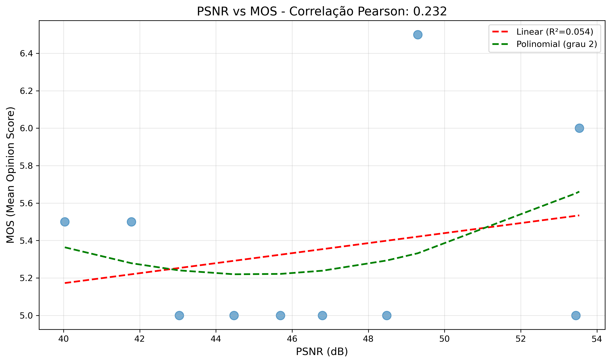
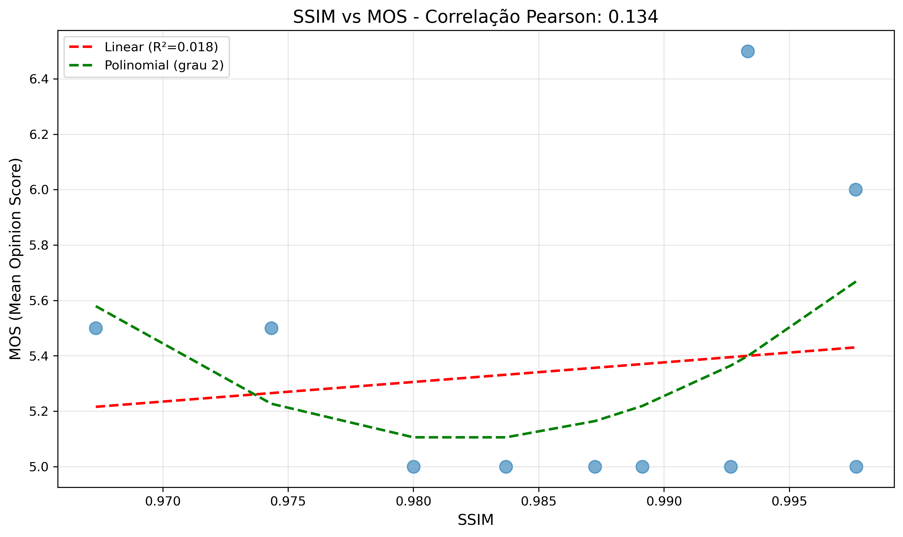
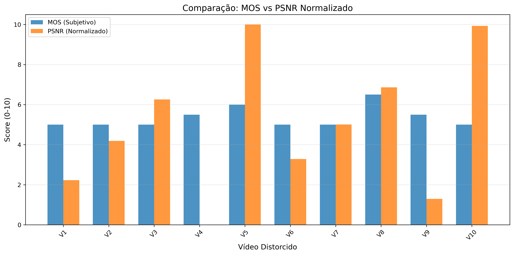

# Análise de Qualidade de Vídeo

**Nome do Teste:** res1

**Data:** 2026-01-02 12:22:16

---

## Métricas Objetivas e Subjetivas

| Vídeo | MOS | PSNR (dB) | SSIM |
|-------|-----|-----------|------|
| h264_b1000k_LF.mp4 | 5.0 | 43.04 | 0.980 |
| h264_b2000k_LF.mp4 | 5.0 | 45.69 | 0.987 |
| h264_b4000k_LF.mp4 | 5.0 | 48.48 | 0.993 |
| h264_b500k_LF.mp4 | 5.5 | 40.03 | 0.967 |
| h264_b8000k_LF.mp4 | 6.0 | 53.54 | 0.998 |
| h265_b1000k_LF.mp4 | 5.0 | 44.47 | 0.984 |
| h265_b2000k_LF.mp4 | 5.0 | 46.79 | 0.989 |
| h265_b4000k_LF.mp4 | 6.5 | 49.30 | 0.993 |
| h265_b500k_LF.mp4 | 5.5 | 41.78 | 0.974 |
| h265_b8000k_LF.mp4 | 5.0 | 53.45 | 0.998 |

## Correlações

| Métrica | Pearson | Spearman |
|---------|---------|----------|
| PSNR | 0.232 | 0.123 |
| SSIM | 0.134 | 0.048 |

## Modelos de Regressão

### PSNR → MOS

- **Linear:** MOS = 0.027 × PSNR + 4.102
- **R² Linear:** 0.054
- **Polinomial (grau 2):** MOS = 0.006 × PSNR² + -0.540 × PSNR + 17.361

### SSIM → MOS

- **Linear:** MOS = 7.078 × SSIM + -1.631
- **R² Linear:** 0.018
- **Polinomial (grau 2):** MOS = 2283.322 × SSIM² + -4483.765 × SSIM + 2206.292

## Gráficos

