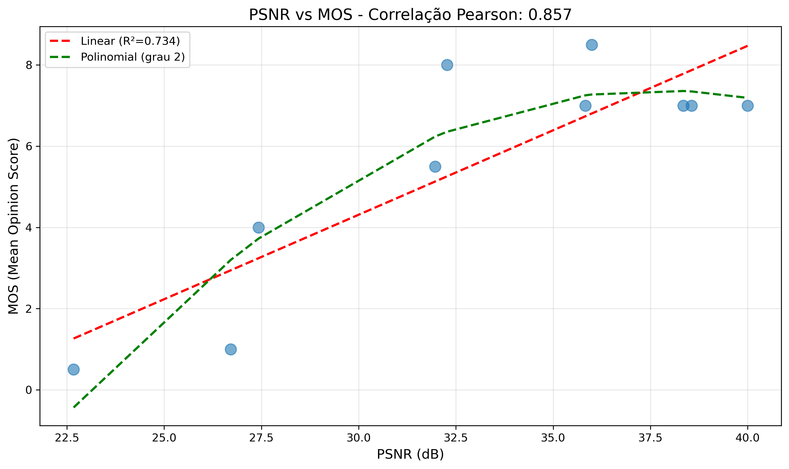
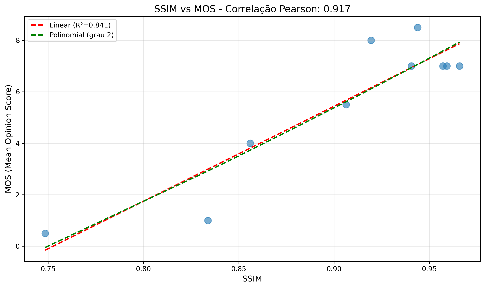
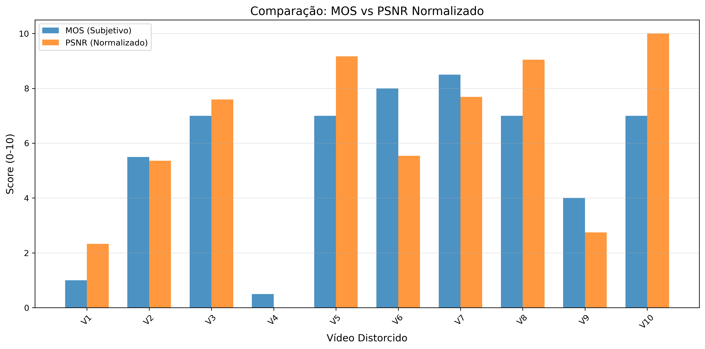

# Análise de Qualidade de Vídeo

**Nome do Teste:** resultadoexemplo

**Data:** 2026-01-03 14:52:27

---

## Métricas Objetivas e Subjetivas

| Vídeo | MOS | PSNR (dB) | SSIM |
|-------|-----|-----------|------|
| H264_1000kbps.mp4 | 1.0 | 26.71 | 0.834 |
| H264_2000kbps.mp4 | 5.5 | 31.97 | 0.906 |
| H264_4000kbps.mp4 | 7.0 | 35.83 | 0.941 |
| H264_500kbps.mp4 | 0.5 | 22.67 | 0.748 |
| H264_8000kbps.mp4 | 7.0 | 38.56 | 0.959 |
| H265_1000kbps.mp4 | 8.0 | 32.27 | 0.919 |
| H265_2000kbps.mp4 | 8.5 | 35.99 | 0.944 |
| H265_4000kbps.mp4 | 7.0 | 38.35 | 0.957 |
| H265_500kbps.mp4 | 4.0 | 27.43 | 0.856 |
| H265_8000kbps.mp4 | 7.0 | 40.00 | 0.966 |

## Correlações

| Métrica | Pearson | Spearman |
|---------|---------|----------|
| PSNR | 0.857 | 0.713 |
| SSIM | 0.917 | 0.713 |

## Modelos de Regressão

### PSNR → MOS

- **Linear:** MOS = 0.416 × PSNR + -8.167
- **R² Linear:** 0.734
- **Polinomial (grau 2):** MOS = -0.035 × PSNR² + 2.607 × PSNR + -41.769

### SSIM → MOS

- **Linear:** MOS = 36.916 × SSIM + -27.788
- **R² Linear:** 0.841
- **Polinomial (grau 2):** MOS = 14.526 × SSIM² + 11.803 × SSIM + -17.020

## Gráficos

