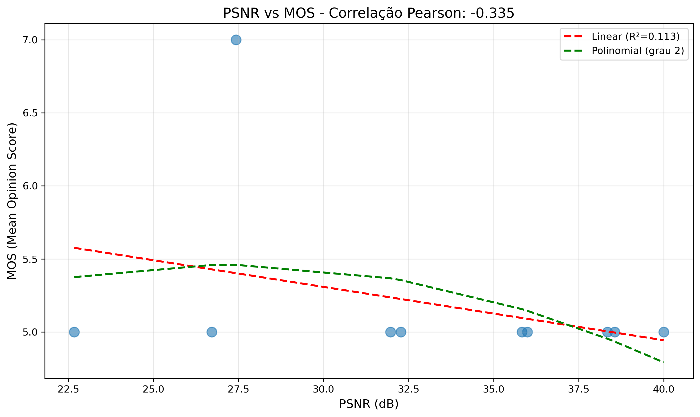
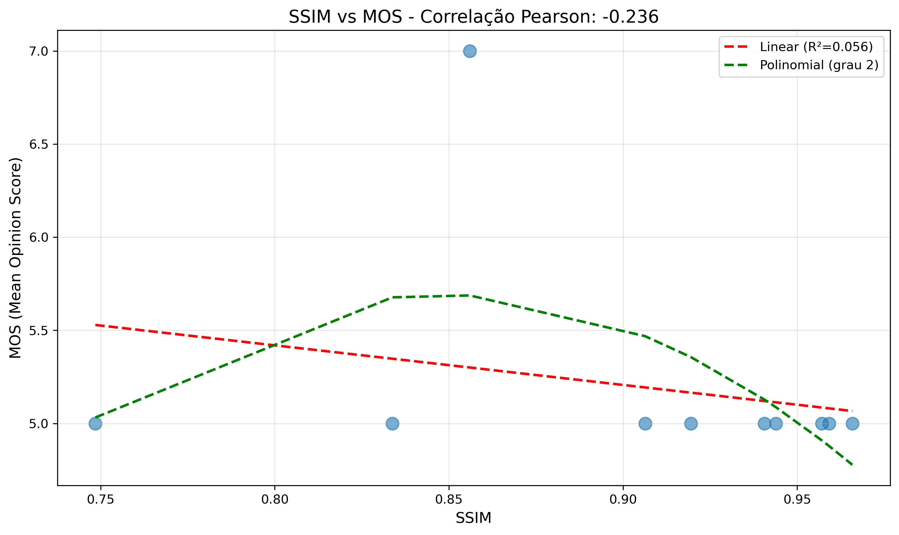
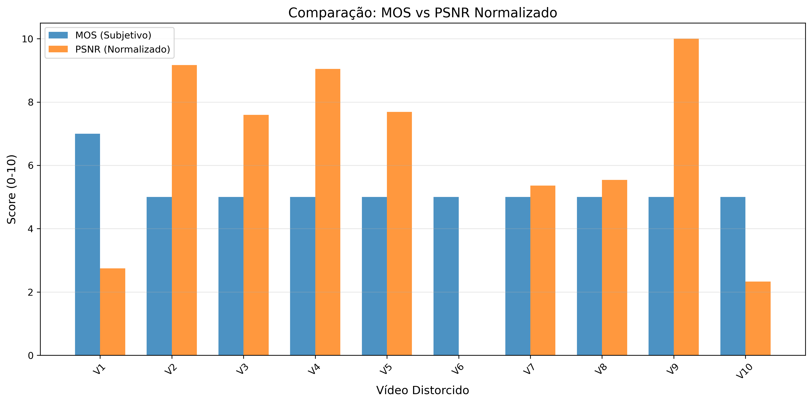

# Análise de Qualidade de Vídeo

**Nome do Teste:** teste

**Data:** 2025-12-29 12:55:52

---

## Métricas Objetivas e Subjetivas

| Vídeo | MOS | PSNR (dB) | SSIM |
|-------|-----|-----------|------|
| H265_500kbps.mp4 | 7.0 | 27.43 | 0.856 |
| H264_8000kbps.mp4 | 5.0 | 38.56 | 0.959 |
| H264_4000kbps.mp4 | 5.0 | 35.83 | 0.941 |
| H265_4000kbps.mp4 | 5.0 | 38.35 | 0.957 |
| H265_2000kbps.mp4 | 5.0 | 35.99 | 0.944 |
| H264_500kbps.mp4 | 5.0 | 22.67 | 0.748 |
| H264_2000kbps.mp4 | 5.0 | 31.97 | 0.906 |
| H265_1000kbps.mp4 | 5.0 | 32.27 | 0.919 |
| H265_8000kbps.mp4 | 5.0 | 40.00 | 0.966 |
| H264_1000kbps.mp4 | 5.0 | 26.71 | 0.834 |

## Correlações

| Métrica | Pearson | Spearman |
|---------|---------|----------|
| PSNR | -0.335 | -0.290 |
| SSIM | -0.236 | -0.290 |

## Modelos de Regressão

### PSNR → MOS

- **Linear:** MOS = -0.036 × PSNR + 6.403
- **R² Linear:** 0.113
- **Polinomial (grau 2):** MOS = -0.004 × PSNR² + 0.222 × PSNR + 2.441

### SSIM → MOS

- **Linear:** MOS = -2.126 × SSIM + 7.120
- **R² Linear:** 0.056
- **Polinomial (grau 2):** MOS = -66.125 × SSIM² + 112.193 × SSIM + -41.898

## Gráficos

