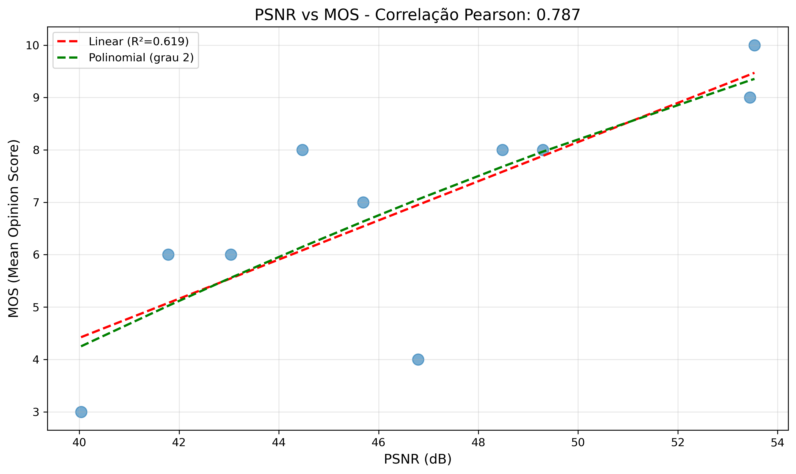
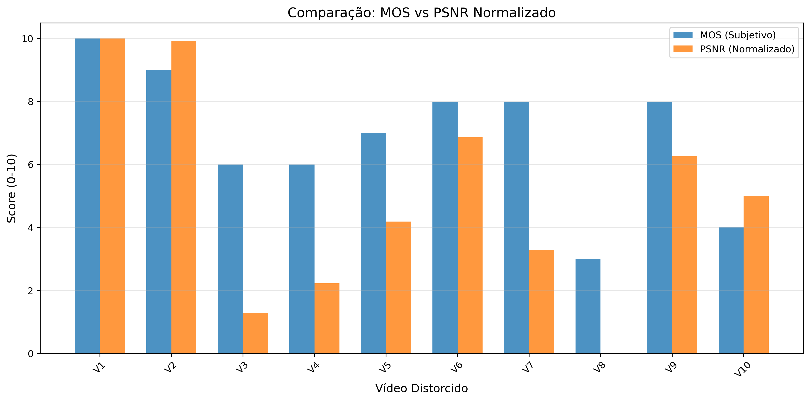

# Análise de Qualidade de Vídeo

**Nome do Teste:** teste_carolina

**Data:** 2025-12-28 23:42:03

---

## Métricas Objetivas e Subjetivas

| Vídeo | MOS | PSNR (dB) | SSIM |
|-------|-----|-----------|------|
| h264_b8000k_LF.mp4 | 10.0 | 53.54 | 0.998 |
| h265_b8000k_LF.mp4 | 9.0 | 53.45 | 0.998 |
| h265_b500k_LF.mp4 | 6.0 | 41.78 | 0.974 |
| h264_b1000k_LF.mp4 | 6.0 | 43.04 | 0.980 |
| h264_b2000k_LF.mp4 | 7.0 | 45.69 | 0.987 |
| h265_b4000k_LF.mp4 | 8.0 | 49.30 | 0.993 |
| h265_b1000k_LF.mp4 | 8.0 | 44.47 | 0.984 |
| h264_b500k_LF.mp4 | 3.0 | 40.03 | 0.967 |
| h264_b4000k_LF.mp4 | 8.0 | 48.48 | 0.993 |
| h265_b2000k_LF.mp4 | 4.0 | 46.79 | 0.989 |

## Correlações

| Métrica | Pearson | Spearman |
|---------|---------|----------|
| PSNR | 0.787 | 0.825 |
| SSIM | 0.777 | 0.812 |

## Modelos de Regressão

### PSNR → MOS

- **Linear:** MOS = 0.374 × PSNR + -10.537
- **R² Linear:** 0.619
- **Polinomial (grau 2):** MOS = -0.005 × PSNR² + 0.892 × PSNR + -22.661

### SSIM → MOS

- **Linear:** MOS = 169.047 × SSIM + -159.831
- **R² Linear:** 0.604
- **Polinomial (grau 2):** MOS = 965.453 × SSIM² + -1729.809 × SSIM + 773.741

## Gráficos

